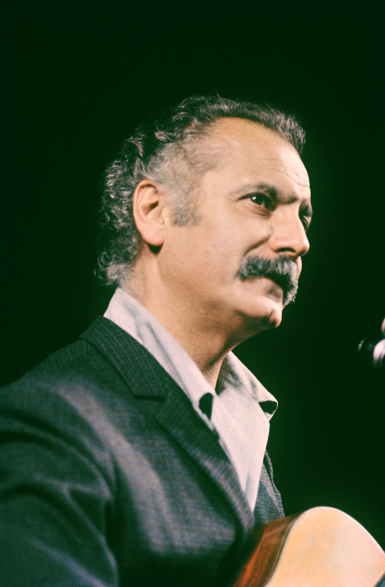

# Get the profile picture of public figures
Quick and dirty script to get the wikimedia picture of a public figure.
Tanks to Samuel DA SAILVA (http://samueld.fr/) for his help


No requirements needed apart python (3)
```
>>> from get_person_image import get_image_url, save_image
>>> url = get_image_url("Georges Brassens")
>>> url
'https://upload.wikimedia.org/wikipedia/commons/1/19/Brassens_TNP_1966.jpg'
>>> # save_image(url, outfile)
>>> save_image(url, 'georges') # no not write the file extension!
georges.jpg
```
